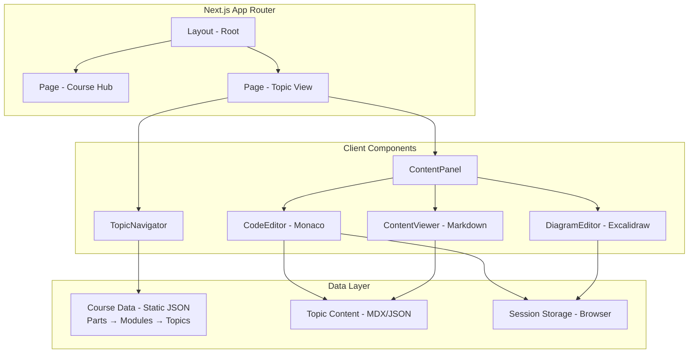
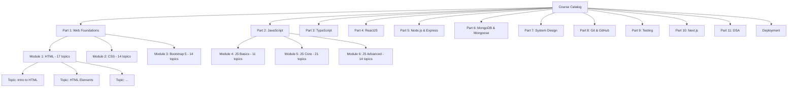

# Design Document: MERN Teaching Platform

## Overview

The MERN Teaching Platform is a Next.js application that provides an integrated learning environment for MERN stack and System Design courses. The platform follows a split-panel layout similar to LeetCode/GeeksforGeeks Practice, with topic navigation on the left and dynamic content rendering on the right. Content types include a Monaco code editor for coding topics, a Markdown-based theory/notes viewer, and an Excalidraw-based diagram editor for system design topics.

The application uses the Next.js App Router with React Server Components where possible, client components for interactive editors, and browser session storage for preserving user progress.

## Architecture



### Content Hierarchy Diagram



### Key Architectural Decisions

1. **Static Data**: Course structure and topic content are stored as static JSON/MDX files organized in a Part → Module → Topic hierarchy. No backend database is required since this is a content-delivery platform. This simplifies deployment and enables ISR/SSG.

2. **Client-Side Editors**: Monaco and Excalidraw do not support SSR. Both are loaded via `next/dynamic` with `ssr: false` to avoid hydration issues.

3. **Session Storage for State**: User modifications (code edits, diagram state) are persisted to `sessionStorage`. This provides temporary persistence without requiring authentication or a backend.

4. **App Router with Route Groups**: Routes are organized using the App Router's file-based routing. A `(platform)` route group encapsulates the teaching interface.

### Project Structure

```
src/
├── app/
│   ├── layout.tsx              # Root layout with metadata
│   ├── page.tsx                # Landing/home page
│   └── (platform)/
│       └── [partSlug]/
│           └── [moduleSlug]/
│               └── [topicSlug]/
│                   └── page.tsx    # Topic view page
├── components/
│   ├── topic-navigator/
│   │   ├── TopicNavigator.tsx
│   │   ├── PartSection.tsx
│   │   ├── ModuleSection.tsx
│   │   └── TopicItem.tsx
│   ├── content-panel/
│   │   ├── ContentPanel.tsx
│   │   ├── CodeEditor.tsx
│   │   ├── ContentViewer.tsx
│   │   └── DiagramEditor.tsx
│   ├── download/
│   │   └── DownloadButton.tsx
│   └── ui/
│       └── ...shared UI components
├── data/
│   ├── courses.json            # Course structure metadata (Parts → Modules → Topics)
│   └── topics/
│       ├── part-01-web-foundations/
│       │   ├── module-01-html/
│       │   │   └── [topic-slug].json
│       │   ├── module-02-css/
│       │   │   └── [topic-slug].json
│       │   └── module-03-bootstrap/
│       │       └── [topic-slug].json
│       ├── part-02-javascript/
│       │   ├── module-04-js-basics/
│       │   │   └── [topic-slug].json
│       │   ├── module-05-js-core/
│       │   │   └── [topic-slug].json
│       │   └── module-06-js-advanced/
│       │       └── [topic-slug].json
│       ├── part-03-typescript/
│       │   ├── module-ts1-basics/
│       │   ├── module-ts2-functions-oop/
│       │   └── module-ts3-advanced-types/
│       ├── part-04-reactjs/
│       │   ├── module-07-react-basics/
│       │   ├── module-08-react19-hooks/
│       │   └── module-09-react-ui-tailwind/
│       ├── part-05-nodejs-express/
│       │   ├── module-10-getting-started-nodejs/
│       │   ├── module-11-core-modules/
│       │   ├── module-12-http-core-server/
│       │   ├── module-13-express-basics/
│       │   ├── module-14-middleware/
│       │   ├── module-15-restful-apis/
│       │   └── module-16-advanced-express/
│       ├── part-06-mongodb-mongoose/
│       │   ├── module-17-mongodb-basics/
│       │   ├── module-18-mongoose-odm/
│       │   ├── module-19-advanced-mongodb/
│       │   └── module-20-auth-security/
│       ├── part-07-system-design/
│       │   ├── module-21-fundamentals/
│       │   ├── module-22-high-level-design/
│       │   ├── module-23-web-performance/
│       │   ├── module-24-realtime-communication/
│       │   └── module-25-micro-frontend/
│       ├── part-08-git-github/
│       │   └── module-28-git/
│       ├── part-09-testing/
│       │   └── module-29-testing/
│       ├── part-10-nextjs/
│       │   └── module-30-nextjs/
│       ├── part-11-dsa/
│       │   └── module-31-dsa/
│       └── deployment/
│           └── module-27-deployment/
├── lib/
│   ├── courses.ts              # Course data access functions
│   ├── topics.ts               # Topic data access functions
│   ├── download.ts             # File download utilities
│   └── session-storage.ts      # Session storage helpers
├── types/
│   └── index.ts                # TypeScript type definitions
└── styles/
    └── globals.css             # Global styles with Tailwind
```

## Components and Interfaces

### TopicNavigator

A client component that renders the hierarchical Part → Module → Topic tree in the left panel.

```typescript
interface TopicNavigatorProps {
  parts: Part[];
  activeTopic: string | null; // current topic slug
  onTopicSelect: (partSlug: string, moduleSlug: string, topicSlug: string) => void;
}
```

**Behavior**:
- Renders Parts as top-level collapsible accordion sections (e.g., "Part 1 — Web Foundations")
- Displays Modules as nested collapsible sub-sections within each Part (e.g., "Module 1 · HTML | Basics of Web Pages")
- Shows individual topics as leaf items within each Module
- Shows topic count per Module
- Highlights the currently selected topic
- Auto-expands the Part and Module containing the active topic
- Supports keyboard navigation for accessibility

### PartSection

A client component that renders a single collapsible Part with its child Modules.

```typescript
interface PartSectionProps {
  part: Part;
  activeTopic: string | null;
  isExpanded: boolean;
  onToggle: () => void;
  onTopicSelect: (partSlug: string, moduleSlug: string, topicSlug: string) => void;
}
```

**Behavior**:
- Displays the Part title with part number prefix (e.g., "Part 1 — Web Foundations")
- Shows total module count for the Part
- Expands/collapses to reveal or hide its child ModuleSections
- Auto-expands if it contains the currently active topic

### ModuleSection

A client component that renders a single collapsible Module with its child Topics.

```typescript
interface ModuleSectionProps {
  module: Module;
  partSlug: string;
  activeTopic: string | null;
  isExpanded: boolean;
  onToggle: () => void;
  onTopicSelect: (partSlug: string, moduleSlug: string, topicSlug: string) => void;
}
```

**Behavior**:
- Displays the Module title with module ID prefix (e.g., "Module 1 · HTML | Basics of Web Pages")
- Shows topic count badge (e.g., "17 topics")
- Expands/collapses to reveal or hide individual TopicItems
- Auto-expands if it contains the currently active topic

### ContentPanel

A client component that switches between CodeEditor, ContentViewer, or DiagramEditor based on the topic type.

```typescript
interface ContentPanelProps {
  topic: Topic;
}
```

**Behavior**:
- Reads `topic.type` to determine which editor/viewer to render
- Passes appropriate props to the child component
- Displays a download button in the panel header

### CodeEditor

A client component wrapping Monaco Editor via `@monaco-editor/react`.

```typescript
interface CodeEditorProps {
  topicSlug: string;
  starterCode: string;
  language: SupportedLanguage;
  onCodeChange: (code: string) => void;
}

type SupportedLanguage = 'javascript' | 'typescript' | 'html' | 'css' | 'json';
```

**Behavior**:
- Dynamically imported with `ssr: false`
- Loads starter code on mount; checks session storage for saved state first
- Saves code changes to session storage on each edit (debounced)
- Provides a reset button to restore starter code
- Adapts height/width to container with min-height of 400px

### ContentViewer

A component that renders Markdown content with syntax-highlighted code blocks.

```typescript
interface ContentViewerProps {
  content: string; // raw Markdown string
}
```

**Behavior**:
- Parses Markdown using `react-markdown` with `remark-gfm` plugin
- Applies syntax highlighting to fenced code blocks via `rehype-highlight` or `react-syntax-highlighter`
- Renders images, headings, lists, and inline formatting
- Provides scrollable layout within the content panel

### DiagramEditor

A client component wrapping Excalidraw for system design diagrams.

```typescript
interface DiagramEditorProps {
  topicSlug: string;
  initialData?: ExcalidrawElement[];
}
```

**Behavior**:
- Dynamically imported with `ssr: false`
- Provides canvas with shapes (rectangles, circles), arrows, and text labels
- Saves diagram state to session storage on changes
- Provides a "Clear Canvas" button to reset the diagram
- Supports export to PNG via Excalidraw's `exportToBlob` API

### DownloadButton

A client component that triggers file downloads.

```typescript
interface DownloadButtonProps {
  topic: Topic;
  getCurrentCode?: () => string;
  getDiagramBlob?: () => Promise<Blob>;
}
```

**Behavior**:
- For code topics: downloads current editor content as a file (e.g., `.js`, `.ts`)
- For content topics: downloads the Markdown source as `.md`
- For diagram topics: exports diagram as PNG via Excalidraw API
- File naming: converts topic title to kebab-case + appropriate extension

## Data Models

### Course Structure (Part → Module → Topic Hierarchy)

The platform organizes content using a three-level hierarchy: **Parts** (top-level subject areas) contain **Modules** (focused learning units), which contain individual **Topics** (single learning items).

```typescript
interface CourseCatalog {
  parts: Part[];
}

interface Part {
  slug: string;           // e.g., "part-01-web-foundations"
  partNumber: number;     // e.g., 1
  title: string;          // e.g., "Web Foundations"
  modules: Module[];
}

interface Module {
  slug: string;           // e.g., "module-01-html"
  moduleId: string;       // e.g., "1", "TS-1", "28"
  title: string;          // e.g., "HTML | Basics of Web Pages"
  topicCount: number;     // e.g., 17
  topics: TopicMeta[];
}

interface TopicMeta {
  slug: string;           // e.g., "semantic-elements"
  title: string;          // e.g., "Semantic Elements"
  type: TopicType;        // "code" | "content" | "diagram"
  order: number;          // display order within module
}

type TopicType = 'code' | 'content' | 'diagram';
```

### courses.json Structure

```json
{
  "parts": [
    {
      "slug": "part-01-web-foundations",
      "partNumber": 1,
      "title": "Web Foundations",
      "modules": [
        {
          "slug": "module-01-html",
          "moduleId": "1",
          "title": "HTML | Basics of Web Pages",
          "topicCount": 17,
          "topics": [
            { "slug": "intro-to-html", "title": "Introduction to HTML", "type": "content", "order": 1 },
            { "slug": "html-elements", "title": "HTML Elements", "type": "code", "order": 2 }
          ]
        },
        {
          "slug": "module-02-css",
          "moduleId": "2",
          "title": "CSS | Styling Web Pages",
          "topicCount": 14,
          "topics": []
        },
        {
          "slug": "module-03-bootstrap",
          "moduleId": "3",
          "title": "Bootstrap 5 | Quick Styling",
          "topicCount": 14,
          "topics": []
        }
      ]
    },
    {
      "slug": "part-02-javascript",
      "partNumber": 2,
      "title": "JavaScript",
      "modules": [
        {
          "slug": "module-04-js-basics",
          "moduleId": "4",
          "title": "JavaScript | Basics",
          "topicCount": 11,
          "topics": []
        },
        {
          "slug": "module-05-js-core",
          "moduleId": "5",
          "title": "JavaScript | Core Concepts",
          "topicCount": 21,
          "topics": []
        },
        {
          "slug": "module-06-js-advanced",
          "moduleId": "6",
          "title": "JavaScript | Advanced Concepts",
          "topicCount": 14,
          "topics": []
        }
      ]
    },
    {
      "slug": "part-03-typescript",
      "partNumber": 3,
      "title": "TypeScript",
      "modules": [
        {
          "slug": "module-ts1-basics",
          "moduleId": "TS-1",
          "title": "TypeScript Basics",
          "topicCount": 11,
          "topics": []
        },
        {
          "slug": "module-ts2-functions-oop",
          "moduleId": "TS-2",
          "title": "TypeScript with Functions & OOP",
          "topicCount": 9,
          "topics": []
        },
        {
          "slug": "module-ts3-advanced-types",
          "moduleId": "TS-3",
          "title": "TypeScript Advanced Types",
          "topicCount": 9,
          "topics": []
        }
      ]
    },
    {
      "slug": "part-04-reactjs",
      "partNumber": 4,
      "title": "ReactJS",
      "modules": [
        {
          "slug": "module-07-react-basics",
          "moduleId": "7",
          "title": "React Basics",
          "topicCount": 25,
          "topics": []
        },
        {
          "slug": "module-08-react19-hooks",
          "moduleId": "8",
          "title": "React 19 | New Hooks",
          "topicCount": 5,
          "topics": []
        },
        {
          "slug": "module-09-react-ui-tailwind",
          "moduleId": "9",
          "title": "React UI & Styling | Tailwind CSS",
          "topicCount": 3,
          "topics": []
        }
      ]
    },
    {
      "slug": "part-05-nodejs-express",
      "partNumber": 5,
      "title": "Node.js & Express",
      "modules": [
        {
          "slug": "module-10-getting-started-nodejs",
          "moduleId": "10",
          "title": "Getting Started with Node.js",
          "topicCount": 5,
          "topics": []
        },
        {
          "slug": "module-11-core-modules",
          "moduleId": "11",
          "title": "Node.js Core Modules",
          "topicCount": 2,
          "topics": []
        },
        {
          "slug": "module-12-http-core-server",
          "moduleId": "12",
          "title": "HTTP & Core Server",
          "topicCount": 5,
          "topics": []
        },
        {
          "slug": "module-13-express-basics",
          "moduleId": "13",
          "title": "Express Basics",
          "topicCount": 5,
          "topics": []
        },
        {
          "slug": "module-14-middleware",
          "moduleId": "14",
          "title": "Middleware in Express",
          "topicCount": 4,
          "topics": []
        },
        {
          "slug": "module-15-restful-apis",
          "moduleId": "15",
          "title": "RESTful APIs with Express",
          "topicCount": 4,
          "topics": []
        },
        {
          "slug": "module-16-advanced-express",
          "moduleId": "16",
          "title": "Advanced Express Features",
          "topicCount": 5,
          "topics": []
        }
      ]
    },
    {
      "slug": "part-06-mongodb-mongoose",
      "partNumber": 6,
      "title": "MongoDB & Mongoose",
      "modules": [
        {
          "slug": "module-17-mongodb-basics",
          "moduleId": "17",
          "title": "MongoDB Basics",
          "topicCount": 5,
          "topics": []
        },
        {
          "slug": "module-18-mongoose-odm",
          "moduleId": "18",
          "title": "Mongoose ODM",
          "topicCount": 4,
          "topics": []
        },
        {
          "slug": "module-19-advanced-mongodb",
          "moduleId": "19",
          "title": "Advanced MongoDB",
          "topicCount": 5,
          "topics": []
        },
        {
          "slug": "module-20-auth-security",
          "moduleId": "20",
          "title": "Authentication & Security",
          "topicCount": 5,
          "topics": []
        }
      ]
    },
    {
      "slug": "part-07-system-design",
      "partNumber": 7,
      "title": "System Design",
      "modules": [
        {
          "slug": "module-21-fundamentals",
          "moduleId": "21",
          "title": "System Design Fundamentals",
          "topicCount": 6,
          "topics": []
        },
        {
          "slug": "module-22-high-level-design",
          "moduleId": "22",
          "title": "High Level Design",
          "topicCount": 8,
          "topics": []
        },
        {
          "slug": "module-23-web-performance",
          "moduleId": "23",
          "title": "Advanced Web Performance",
          "topicCount": 6,
          "topics": []
        },
        {
          "slug": "module-24-realtime-communication",
          "moduleId": "24",
          "title": "Real-Time Communication",
          "topicCount": 4,
          "topics": []
        },
        {
          "slug": "module-25-micro-frontend",
          "moduleId": "25",
          "title": "Micro Frontend System Design",
          "topicCount": 8,
          "topics": []
        }
      ]
    },
    {
      "slug": "part-08-git-github",
      "partNumber": 8,
      "title": "Git & GitHub",
      "modules": [
        {
          "slug": "module-28-git",
          "moduleId": "28",
          "title": "Git",
          "topicCount": 5,
          "topics": []
        }
      ]
    },
    {
      "slug": "part-09-testing",
      "partNumber": 9,
      "title": "Testing",
      "modules": [
        {
          "slug": "module-29-testing",
          "moduleId": "29",
          "title": "Testing",
          "topicCount": 5,
          "topics": []
        }
      ]
    },
    {
      "slug": "part-10-nextjs",
      "partNumber": 10,
      "title": "Next.js",
      "modules": [
        {
          "slug": "module-30-nextjs",
          "moduleId": "30",
          "title": "Next.js",
          "topicCount": 6,
          "topics": []
        }
      ]
    },
    {
      "slug": "part-11-dsa",
      "partNumber": 11,
      "title": "DSA",
      "modules": [
        {
          "slug": "module-31-dsa",
          "moduleId": "31",
          "title": "DSA",
          "topicCount": 8,
          "topics": []
        }
      ]
    },
    {
      "slug": "deployment",
      "partNumber": 12,
      "title": "Deployment",
      "modules": [
        {
          "slug": "module-27-deployment",
          "moduleId": "27",
          "title": "Deployment",
          "topicCount": 5,
          "topics": []
        }
      ]
    }
  ]
}
```

### Topic Content

```typescript
interface Topic {
  slug: string;
  title: string;
  type: TopicType;
  partSlug: string;
  moduleSlug: string;
  content: CodeTopicContent | ContentTopicContent | DiagramTopicContent;
}

interface CodeTopicContent {
  starterCode: string;
  language: SupportedLanguage;
  instructions?: string;    // optional Markdown instructions shown above editor
}

interface ContentTopicContent {
  markdown: string;         // full Markdown content
}

interface DiagramTopicContent {
  description: string;      // problem description for the diagram exercise
  initialElements?: ExcalidrawElement[]; // optional pre-loaded diagram elements
}
```

### Session Storage Schema

```typescript
// Key format: "mern-platform:{partSlug}:{moduleSlug}:{topicSlug}:code"
// Value: string (current code content)

// Key format: "mern-platform:{partSlug}:{moduleSlug}:{topicSlug}:diagram"
// Value: JSON string of ExcalidrawElement[]
```

### Download File Naming

```typescript
// Input: topic.title = "useState Hook", topic.type = "code", language = "javascript"
// Output: "usestate-hook.js"

// Input: topic.title = "REST API Design", topic.type = "content"
// Output: "rest-api-design.md"

// Input: topic.title = "Microservices Architecture", topic.type = "diagram"
// Output: "microservices-architecture.png"
```


## Correctness Properties

*A property is a characteristic or behavior that should hold true across all valid executions of a system—essentially, a formal statement about what the system should do. Properties serve as the bridge between human-readable specifications and machine-verifiable correctness guarantees.*

### Property 1: Content type routing

*For any* topic with a defined type ("code", "content", or "diagram"), the ContentPanel SHALL render the component corresponding to that type — CodeEditor for "code", ContentViewer for "content", DiagramEditor for "diagram".

**Validates: Requirements 1.2, 1.3, 1.4**

### Property 2: Active topic highlighting

*For any* topic slug that is currently selected, the TopicNavigator SHALL apply the active highlight class to exactly that topic item and no other items.

**Validates: Requirements 1.6**

### Property 3: Starter code initialization

*For any* code topic with a non-empty starter code string, when the topic is loaded fresh (no session storage entry), the CodeEditor value SHALL equal the starter code exactly.

**Validates: Requirements 2.3**

### Property 4: Session storage persistence round-trip

*For any* user modification (code string or diagram element array), saving to session storage and then reading back SHALL produce a value equal to the original modification.

**Validates: Requirements 2.4, 4.4**

### Property 5: Reset restores starter code

*For any* code topic, after the student modifies the code and then triggers a reset, the CodeEditor value SHALL equal the original starter code string for that topic.

**Validates: Requirements 2.5**

### Property 6: Markdown structure preservation

*For any* valid Markdown string containing headings, the ContentViewer output SHALL contain corresponding heading elements (h1-h6) that preserve the heading text content.

**Validates: Requirements 3.1**

### Property 7: Clear canvas empties all elements

*For any* non-empty diagram state (with 1 or more elements), triggering the clear canvas action SHALL result in an empty elements array.

**Validates: Requirements 4.5**

### Property 8: Download content fidelity

*For any* text-based topic (code or content), the downloaded file content SHALL be byte-equal to the source content at the time of download.

**Validates: Requirements 5.1, 5.2**

### Property 9: File naming transformation

*For any* topic title string and topic type, the generated filename SHALL be the title converted to lowercase kebab-case with the correct file extension (.js/.ts/.html/.css/.json for code, .md for content, .png for diagram).

**Validates: Requirements 5.4**

### Property 10: Topic count accuracy

*For any* module in the course data, the displayed topic count SHALL equal the length of the topics array for that module.

**Validates: Requirements 6.4**

## Error Handling

### Code Editor Errors

| Scenario | Handling |
|----------|----------|
| Monaco fails to load (CDN/network issue) | Display a fallback textarea with a "Monaco unavailable" notice. Retain code editing capability. |
| Session storage full or unavailable | Catch `QuotaExceededError`, warn the user that changes won't be saved, continue editing. |
| Invalid language mode | Default to "javascript" if an unsupported language is specified. |

### Diagram Editor Errors

| Scenario | Handling |
|----------|----------|
| Excalidraw fails to load | Display an error message with retry button. |
| Corrupted session storage data | Discard invalid data, load with empty canvas, log warning to console. |
| PNG export fails | Show toast notification with error message, suggest trying again. |

### Content Viewer Errors

| Scenario | Handling |
|----------|----------|
| Invalid Markdown syntax | Render as plain text; `react-markdown` is tolerant of malformed input. |
| Missing image references | Display alt text in place of broken image. Use `next/image` with fallback. |

### Download Errors

| Scenario | Handling |
|----------|----------|
| Empty content for download | Disable download button when content is empty. |
| Blob creation fails | Catch error, show toast notification to user. |

### Navigation Errors

| Scenario | Handling |
|----------|----------|
| Invalid route (part/module/topic slug not found) | Redirect to 404 page using Next.js `notFound()` function. |
| Course data fails to load | Display error boundary with retry option. |

## Testing Strategy

### Unit Tests

Unit tests cover specific component behaviors and edge cases:

- **TopicNavigator**: Renders correct Part → Module → Topic hierarchy, handles empty parts, collapses/expands Part and Module sections
- **PartSection**: Renders part title with module count, toggles collapse state
- **ModuleSection**: Renders module title with topic count, toggles collapse state
- **ContentPanel**: Switches between editor types correctly
- **CodeEditor**: Loads starter code, handles reset, validates language prop
- **ContentViewer**: Renders Markdown elements, handles empty content
- **DiagramEditor**: Initializes Excalidraw, handles clear canvas
- **DownloadButton**: Generates correct filenames, handles missing content
- **Session Storage helpers**: Handles missing keys, corrupted data, quota errors

### Property-Based Tests

Property-based tests validate universal correctness properties using [`fast-check`](https://github.com/dubzzz/fast-check):

- **Library**: `fast-check` (JavaScript/TypeScript PBT library)
- **Minimum iterations**: 100 per property test
- **Tagging format**: `Feature: mern-teaching-platform, Property {N}: {title}`

Properties to implement:
1. Content type routing — generate random topics with each type, verify correct component selection
2. Active topic highlighting — generate random topic slugs, verify highlight logic
3. Starter code initialization — generate random code strings, verify initial load
4. Session storage round-trip — generate random strings and object arrays, verify save/load equality
5. Reset restores starter code — generate random starter code + edits, verify reset behavior
6. Markdown structure preservation — generate random Markdown with headings, verify output structure
7. Clear canvas — generate random non-empty element arrays, verify clear produces empty array
8. Download content fidelity — generate random content strings, verify download output matches
9. File naming transformation — generate random title strings and types, verify kebab-case + extension
10. Topic count accuracy — generate random Part/Module structures, verify count matches topics array length

### Integration Tests

Integration tests verify component interactions and real browser behavior:

- Full page render with Part → Module → Topic navigation and content switching
- Session storage persistence across navigation between modules
- Download triggers and file generation
- Responsive layout at breakpoint boundaries
- Monaco and Excalidraw dynamic loading
- Deep-linking to a specific topic via URL (`/part-slug/module-slug/topic-slug`)

### Testing Tools

| Tool | Purpose |
|------|---------|
| `vitest` | Test runner and assertion library |
| `@testing-library/react` | Component rendering and queries |
| `fast-check` | Property-based test generation |
| `jsdom` | DOM environment for unit tests |

