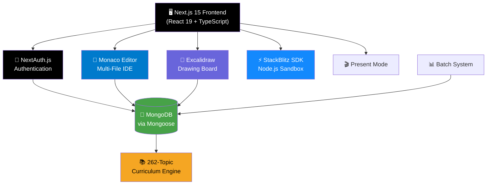
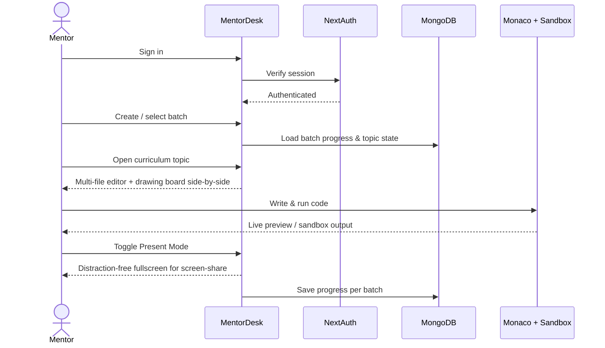
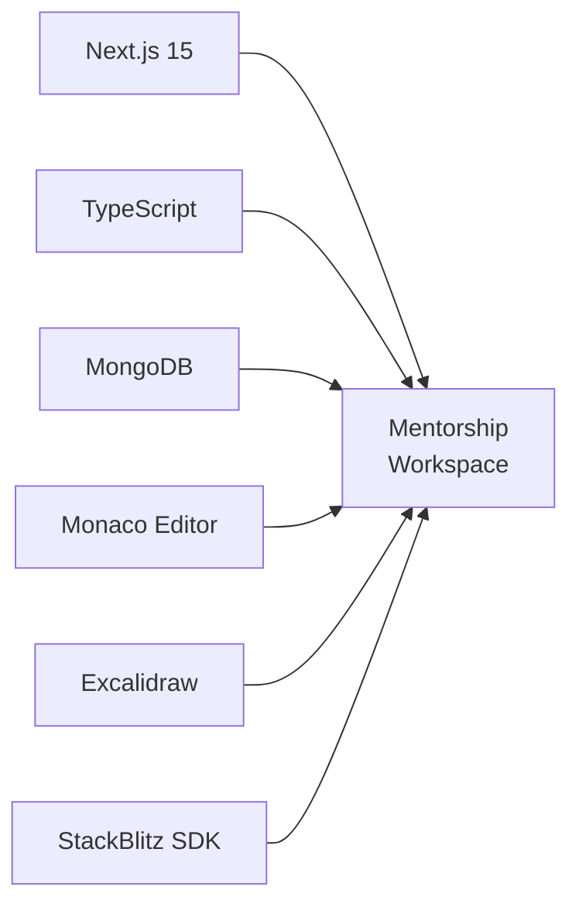

<div align="center">

# 🎓 MentorDesk

### 🧑‍🏫 All-in-One Mentorship Platform for Teaching Full-Stack Web Development

[](https://nextjs.org/)
[](https://react.dev/)
[](https://www.typescriptlang.org/)
[](https://www.mongodb.com/)
[](https://authjs.dev/)
[](https://tailwindcss.com/)
[](https://microsoft.github.io/monaco-editor/)
[](https://excalidraw.com/)

[](LICENSE)
[](https://github.com/vikasthakurr/mentordesk/pulls)
[](https://github.com/vikasthakurr/mentordesk/stargazers)
[](https://github.com/vikasthakurr/mentordesk/issues)
[](https://github.com/vikasthakurr/mentordesk/commits/main)

[**Live Demo**](https://mentordesk-ten.vercel.app/) · [**Report Bug**](https://github.com/vikasthakurr/mentordesk/issues) · [**Request Feature**](https://github.com/vikasthakurr/mentordesk/issues)

</div>

<br>

<div align="center">

### "Teach full-stack dev — without switching tabs."

</div>

<br>

## 📋 Table of Contents

<details open>
<summary>Click to expand/collapse</summary>

- [Overview](#-overview)
- [By the Numbers](#-by-the-numbers)
- [Features](#-features)
- [Architecture](#️-architecture)
- [Tech Stack](#️-tech-stack)
- [Application Workflow](#-application-workflow)
- [Curriculum](#-curriculum)
- [Project Structure](#-project-structure)
- [Getting Started](#-getting-started)
- [Environment Variables](#️-environment-variables)
- [Security](#️-security-considerations)
- [Roadmap](#-roadmap)
- [Contributing](#-contributing)
- [License](#-license)
- [Author](#-author)

</details>

---

## 🌟 Overview

**MentorDesk** is a purpose-built workspace for developers who teach. Instead of juggling a code editor, a whiteboard app, a terminal, and a screen-share window, MentorDesk puts a **multi-file code editor, a drawing board, a live preview, and a Node.js sandbox** into a single browser tab — so a mentor can explain a concept, sketch it, code it, and run it without ever breaking flow in front of students.

It ships with a **built-in 262-topic full-stack curriculum** (from Web Foundations to Deployment) and a **batch system** so a mentor can run multiple cohorts in parallel, each with isolated progress tracking.

> **One tab. One session. Everything a mentor needs to teach.**

---

## 📊 By the Numbers

<div align="center">

| 🧩 Parts | 📦 Modules | 📚 Topics |
|:---:|:---:|:---:|
| **12** | **33** | **262** |

</div>

---

## ✨ Features

<table>
<tr>
<td width="50%" valign="top">

### 💻 Multi-File Editor
- HTML, CSS, JS & TypeScript in one workspace
- Monaco-powered IntelliSense and autocomplete
- Live preview updates as you type
- Built for live, in-session demonstration

### 🎨 Drawing Board
- Sketch architecture diagrams on the fly
- Annotate flows and system designs
- Sits right alongside the code editor
- Excalidraw-based, hand-drawn feel

</td>
<td width="50%" valign="top">

### 🎬 Present Mode
- One-click distraction-free fullscreen
- Optimized for clean screen-sharing
- No stray tabs or UI chrome on display

### 📊 Batch System
- Run multiple cohorts in parallel
- Isolated progress per batch
- Isolated code/workspace state per batch
- Track student progress across 262 topics

</td>
</tr>
</table>

---

## 🏗️ Architecture



---

## 🛠️ Tech Stack

| Layer | Technologies |
|---|---|
| **Frontend** | Next.js 15 (App Router), React 19, TypeScript 5, Tailwind CSS 4 |
| **Authentication** | NextAuth.js v5 (beta), `@auth/mongodb-adapter`, bcryptjs |
| **Database** | MongoDB, Mongoose 9 |
| **Code Editor** | Monaco Editor (`@monaco-editor/react`) with IntelliSense |
| **Drawing Board** | Excalidraw (`@excalidraw/excalidraw`) |
| **Live Sandbox** | StackBlitz SDK — in-browser Node.js execution |
| **Content Rendering** | `react-markdown`, `remark-gfm`, `rehype-highlight` |
| **Testing** | Vitest, React Testing Library, `fast-check` (property-based testing) |
| **Analytics / Hosting** | Vercel Analytics, Vercel |

---

## 🔄 Application Workflow



---

## 📚 Curriculum

**262 topics across 33 modules, organized into 12 parts:**

| Part | Focus Area | Modules | Topics |
|---|---|:---:|:---:|
| 1 | Web Foundations | 3 | 44 |
| 2 | JavaScript | 3 | 46 |
| 3 | TypeScript | 3 | 29 |
| 4 | React.js | 3 | 33 |
| 5 | Node.js & Express | 7 | 30 |
| 6 | MongoDB & Mongoose | 4 | 19 |
| 7 | System Design | 5 | 32 |
| 8 | Git & GitHub | 1 | 5 |
| 9 | Testing | 1 | 5 |
| 10 | Next.js | 1 | 6 |
| 11 | DSA | 1 | 8 |
| 12 | Deployment | 1 | 5 |

---

## 📂 Project Structure

```text
mentordesk/
│
├── .github/
│   └── workflows/            # CI/CD pipelines
│
├── .kiro/
│   └── specs/
│       └── mern-teaching-platform/   # Feature specs & planning docs
│
├── public/                   # Static assets
│
├── src/
│   ├── app/                  # Next.js App Router pages & API routes
│   ├── components/           # Editor, drawing board, present mode, etc.
│   ├── lib/                  # Auth, DB, and shared utilities
│   └── models/               # Mongoose schemas
│
├── .env
├── .gitignore
├── next.config.ts
├── tailwind.config / postcss.config.mjs
├── tsconfig.json
├── vitest.config.ts
├── vercel.json
└── package.json
```

> The exact folder structure may vary depending on the current implementation.

---

## 🚀 Getting Started

### Prerequisites

- [Node.js](https://nodejs.org/) & npm
- [Git](https://git-scm.com/)
- A **MongoDB** connection string (local or Atlas)

<details>
<summary><b>1️⃣ Clone the repository</b></summary>

```bash
git clone https://github.com/vikasthakurr/mentordesk.git
cd mentordesk
```

</details>

<details>
<summary><b>2️⃣ Install dependencies</b></summary>

```bash
npm install
```

</details>

<details>
<summary><b>3️⃣ Configure environment variables</b></summary>

Create a `.env` file in the project root — see [Environment Variables](#️-environment-variables) below.

</details>

<details>
<summary><b>4️⃣ Run the dev server</b></summary>

```bash
npm run dev
```

The app will be available at the local development URL shown in your terminal.

</details>

<details>
<summary><b>5️⃣ Run tests</b></summary>

```bash
npm run test          # single run
npm run test:watch    # watch mode
```

</details>

<details>
<summary><b>6️⃣ Build for production</b></summary>

```bash
npm run build
npm run start
```

</details>

---

## ⚙️ Environment Variables

Create a `.env` file in the project root:

```env
# Database
MONGODB_URI=your_mongodb_connection_string

# Auth.js / NextAuth
AUTH_SECRET=your_auth_secret
NEXTAUTH_URL=http://localhost:3000

# Add OAuth provider credentials here if configured
```

> ⚠️ **Never commit your `.env` file or secrets to GitHub.**

---

## 🛡️ Security Considerations

| Consideration | Implementation |
|---|---|
| Authentication | NextAuth.js v5 with MongoDB adapter |
| Password hashing | bcryptjs |
| Secrets management | Environment variables (`.env`) |
| Data access | Mongoose schema validation |
| Batch isolation | Per-batch progress & workspace state |
| Testing | Vitest + property-based tests (`fast-check`) |

---

## 📌 Roadmap

- [ ] 👥 Real-time collaborative editing between mentor & students
- [ ] 🎥 Session recording and playback
- [ ] 🧪 In-app coding assessments and quizzes
- [ ] 📈 Batch-level analytics dashboard
- [ ] 🗂️ Custom curriculum builder for mentors
- [ ] 🔔 Session reminders & scheduling
- [ ] 💬 In-editor chat / doubt resolution
- [ ] 🌐 Public student-facing progress view
- [ ] 📱 Mobile-responsive present mode
- [ ] ☁️ Exportable session notes & whiteboards

---

## 🎯 Project Goals & Learning Outcomes

MentorDesk was built to solve a real problem in live, screen-shared teaching: too many tabs, too much context-switching. It brings together a code editor, a whiteboard, a sandbox, and a curriculum tracker into one Next.js application — covering full-stack architecture, real-time-feeling UI composition, authentication, schema design, and in-browser code execution.



---

## 🤝 Contributing

Contributions are welcome! To contribute:

1. Fork the repository
2. Create your feature branch (`git checkout -b feature/AmazingFeature`)
3. Commit your changes (`git commit -m 'Add some AmazingFeature'`)
4. Push to the branch (`git push origin feature/AmazingFeature`)
5. Open a Pull Request

---

## 📄 License

Distributed under the MIT License. See `LICENSE` for more information.

---

## 👨‍💻 Author

**Vikas Thakur**
Full Stack Developer

GitHub: [github.com/vikasthakurr](https://github.com/vikasthakurr) · Live App: [mentordesk-ten.vercel.app](https://mentordesk-ten.vercel.app/)

---

<div align="center">

### ⭐ If you found this project useful, consider giving it a star!

**Built for mentors, by developers — with Next.js, TypeScript, MongoDB, Monaco Editor & Excalidraw.**

</div>
